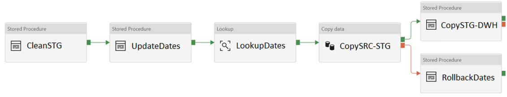
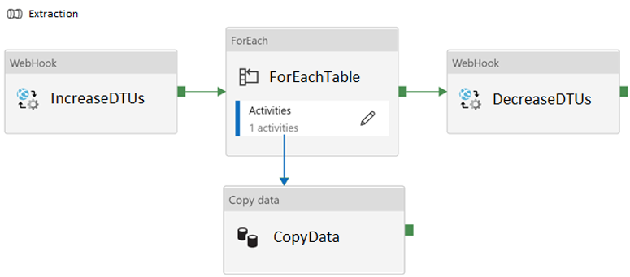
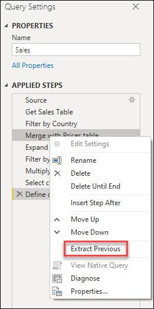
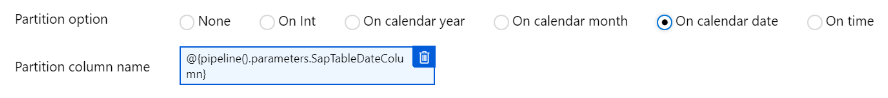

## General description

* This document contains a sequence of patterns, practices and suggestions to conduct a code review of the contribution others made about Azure Data Factory assets.

## Objetivos/alcance

* To effectively perform code reviews by validating the development and ensuring the qualite of the assets. The following technologies are covered:
   * [Azure Data Factory Pipelines](#pipelines)
   * [Azure Data Factory Data Flows](#dataflows)
   * [Azure Data Factory Power Query](#powerquery)
   * [Azure Data Factory Datasets](#datasets)

## <a id="pipelines">Azure Data Factory Pipelines</a>

### Checklist
At the moment of performing a code review of Azure Data Factory pipelines, when the answer of any of the following questions is not satisfactory, suggestions and recomendations can be made in favor of changes:

1.  [ ] Has the pipeline the right naming convention pl_{proceso}_{dataset}?
2.  [ ] Have the pipeline activities a consistent naming convetion? For instance {action}{object} or {action}{source}-{destination}. LookupDate, CopyADLS-Synapse., etc. Have the activities a description to complement the documentation of the activity purpoise?
3.  [ ] Is the pipeline stored in a comprehensive folder data structure to facility its location? Remember that folders are only visible when browsing assets on Azure Data Factory since they do not represent actual folders in a git repository.
4.  [ ] Does the pipeline use ELT (vs ETL) techniques in any of the following situations?<br />
   4.1. Data volume is big (in the order of GBs).<br />
   4.2. Source and destination of the data being processed is the same.<br />
   4.3. The sinking service is optimized for massive data loading, like Azure Synapse.<br />
5.  [ ] Does the pipeline provide a mechanism to rollback to a valid data state in case of a failure or are they idepotent? Please consider the cases when a pipeline can fail and leave data in an inconsistent state.<br /><br />
<br />
***Important:** If you handle the failure of an activity, the pipeline where the activity ran will not report its state as "Fail" when an error occurs. In such case, does the pipeline provide a mechanism to communicate to the administrator or process owner that an error has occured?*
<br /><br />
6.  [ ] Does the pipeline offer a mechanism for incremental data loading when moving big amounts of data?
7.  [ ] Does the pipeline query the required (no more) data to perform the intended operation? Quering more data than needed can put an uneeded pressure on the source system.
8.  [ ] If the pipeline contains a complex data processing structure involving multiple steps, is the pipeline correctly modularized in subpipelines?<br /><br />

<br /><br />
9.  [ ] If the pipeline will perform a massive data loading that will impact the performance of the source/sink and such systems are elastics (cloud), does it configure the right performance level before an after performing the data-intensive operation?
<br /><br />

<br /><br />
10.  [ ] For source/sink with Azure Synapse, does the pipeline enabled the reading-writing using an Azure Storage account for staging data? Such configuration has performance implications since enables Azure Synapse to perform the operation in batches rather than row by now.
11.  [ ] Have all the catalog/dimension tables a column **last updated**? Such tables usually contain inmutable records or records that are updated rarely (and in general, they do not require data transformations).
12.  [ ] Does the pipeline make effective uses of parametrization instead of hard-coding values used on calculations or queries? This helps to the reutilization of pipelines allowing deduplication of "ideas".
13.  [ ] Is data integrity dissable from relational system when loading massive amounts of data into them? This can significantly (and in some cases be required) improve the performance of the operation. For example:
```sql
ALTER INDEX ALL ON dbo.[Table Name] DISABLE

### Do the work

ALTER INDEX ALL ON dbo.[Table Name] REBUILD
```

## <a id="dataflows">Azure Data Factory Data Flows</a>

### Checklist
At the moment of performing a code review of Azure Data Factory Data Flows, when the answer of any of the following questions is not satisfactory, suggestions and recomendations can be made in favor of changes:

1. [ ] Has the Data Flow the right naming convention df_{datastore}_{dataset}?
2. [ ] Is the Data Flow complexity correct by the modularization of the data processing steps? If not, it is preferable to divide complex routines into smaller, easier to follow, routines. You can apply the Read-Process-Store pattern.
3. [ ] Do the activities use the right partitioning configuration? In general, it is highly advisable to keep the same partitioning along the Data Flow as repartition is an operation that incurs in high IO/CPU. However, when partitions are sckewed, that means, they don't contain the same amount of data, certain operations can be impacted in performance. If the case, then it is prefferable to invest time in repartitioning and then continue with the processing instead of degradating the performance of all subsequential operations. `Joins` for instance are a case of such operations. The operations that usually change the data balance across partition are `JOIN` and `AGGREGATE`. You should follow a repartitioning stragtegy depending on the case. There is no a silver-plate strategy. And a rule when repartitioning, try to avoid over-partitioning. Use a number of partitions in the order of 2X the number of cores in your cluster. Use `Round Robin` when you don't have a good candidate for a distribution key. Use `Hash` with the column used in `Join` when there is a `Join` operation downstream.
<br /><br />

<br /><br />
4.  [ ] Are `Join` operations used effectively? `Join` operations can be expensive when the partitions are not balanced. Perform smaller data table `Joins` first, leaving the bigger tables for later. If you are joining two tables of unproportional data (for instance, a 1TB table with a 10GB table), consider `Browcast` the smaller table to improve performance.
<br /><br />

<br /><br />
5.  [ ] Is the logging level configured correctly? By default, Data Flow configures logging level to `Verbose`. Such configuration is optimal when developing, but too expensive to run in a production environment. It is advisable to configure logging to `Basic` when moving the Data Flow to higher environments.
6.  [ ] Does the pipeline contain Data Flows that execute in parallel? Review if this configuration is strictly needed. Each Data Flow is executed in an insolated environment in the cluster and hence once Data Flow can use the cluster at a time meaning that such pipeline will spin up 2 clusters. If the IR is configured with the `TTL` property, then there is a benefit at executing the Data Flows in sequence instead.
7.  [ ] Is Data Flow not involved in a For Each activity? If it is, it is highly advisable to do not.
8.  [ ] Are you tacking advantage of less strict reading protocol when reading from transactional databases? If possible by your business need, configure your queries with `Read uncommited` protocol which offers better performance.
9.  [ ] Does the Data Flow consume only the required information to perform the operations from the source system? Data Flows can read tables o SQL queries. SQL queries are effective when selecting a subset of the information. That beeing said, complex queries shall not be used when big data volumes as they impose a resources stress in the source system. Use ELT strategies in such case.
10.  [ ] Does reading/writing from/to Azure Synapse make use of Staging? Such configuration has performance implications since enables Azure Synapse to perform the operation in batches rather than row by now.
11.  [ ] Is partitioning of Azure SQL Databases configured to `Source`? Are you using the right amount of partitions in the order of (no more of) 5?
12.  [ ] Does Data Flows sink data in `parquet` if possible? `Parquet` is the recommended data format for Apache Spark.

## <a id="powerquery">Azure Data Factory Power Query</a>

### Checklist
At the moment of performing a code review of Azure Data Factory Power Query, when the answer of any of the following questions is not satisfactory, suggestions and recomendations can be made in favor of changes:

1. [ ] Does the Power Query have the right naming convention pq_{datastore}_{dataset}?
2. [ ] Are steps following a consistent naming convention that is easy to read and undestand? For instance {action}{object}. Do not use default names. Add a description to the step if the operation is not 100% clear.
3. [ ] Has the Power Query the right level of complexity and steps? If not, try to modularize your work in multiple sequential Power Query steps. Use the `Extract Previous` function to split a Power Query in multiple modules.
<br /><br />

<br />
3. [ ] Is the Power Query used for data preparation or integration of multiple datasets? Otherwise, consider using another tool.
4. [ ] Does the Power Query transformation apply filter operations as soon as possible?
5. [ ] When working with unstructured datasets like CSVs or TXT, are columns in the correct data format?
6. [ ] Does the Power Query make effective use of parameters?
7. [ ] Does the Power Query encapsulate complex logic in functions that can be reused across?

## <a id="datasets">Azure Data Factory Datasets</a>

### Checklist
At the moment of performing a code review of Azure Data Factory Datasets, when the answer of any of the following questions is not satisfactory, suggestions and recomendations can be made in favor of changes:

1. [ ] Does the dataset have the right naming convention df_{datastore}_{dataset}?
2. [ ] Does the pipeline make a sensible amount of datasets? Consider to use parameterized datasets to avoid the proliferation of datasets that have similar use cases.
3. [ ] Does the dataset make use of `parquet` format when data is stored in Storage Accounts?
4. [ ] When the dataset contain files (parquet, avro, csv, etc), does it use wildcards or directories? This is the recommended way of reading multiple files.
5. [ ] When the dataset is stored in a HDFS-compatible storage accounts, does it make use of partitioning using folder structures when data is big? Avoid having directories will large amounts of files which slow down listing procedure.
6. [ ] When the dataset will be processed by Azure Data Flow or Databricks, are files of the right sizes? In general, Spark is more efficient processing big files (around 100MB - 1GB) rather than a lot of small files.
7. [ ] When the dataset uses SAP data, does it uses the recommended connector SAP Tables?
8. [ ] When the dataset uses SAP data and the SAP Table Connector, is partitioning being used when the amounts of information to query is big? As a best práctice, try to use a column as patitioning and configure such as the partioning in your datasets (in the directory structure if dealing with HDFS-compatible storage)
<br /><br />

<br />
### Additional references

* [Mapping data flows performance and tuning guide](https://docs.microsoft.com/EN-US/azure/data-factory/concepts-data-flow-performance)
* [Data Flow activity in Azure Data Factory](https://docs.microsoft.com/EN-US/azure/data-factory/control-flow-execute-data-flow-activity)
* [Best practices when working with Power Query](https://docs.microsoft.com/en-us/power-query/best-practices)
