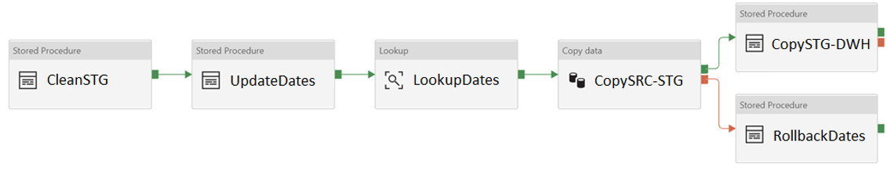
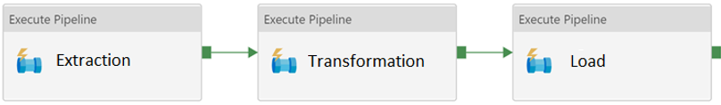
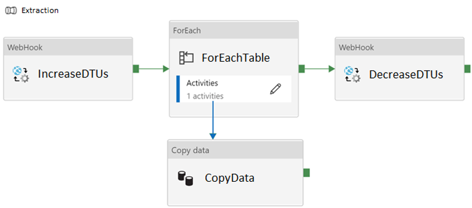
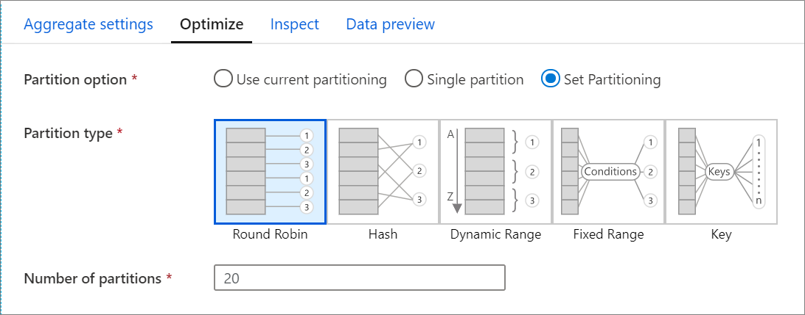
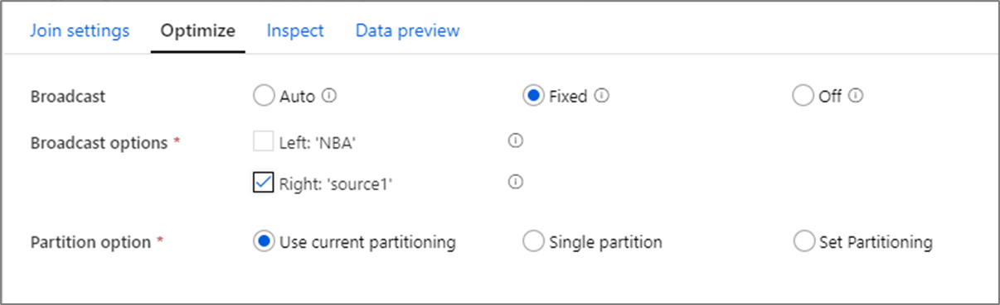
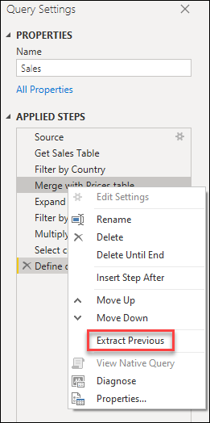
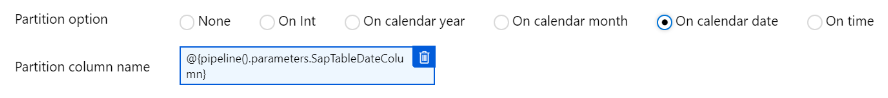

## Descripción general

* Este documento contiene una serie de lineamientos y sugerencias para conducir una revisión de código de las contribuciones que se realicen en la materia de Azure Data Factory pipelines.

## Objetivos/alcance

*  Realizar revisiones de código efectivas para validar el desarrollo y comprobar su calidad acorde con las prácticas definidas para las siguientes tecnologías:
   * [Azure Data Factory Pipelines](#pipelines)
   * [Azure Data Factory Data Flows](#dataflows)
   * [Azure Data Factory Power Query](#powerquery)
   * [Azure Data Factory Datasets](#datasets)

## <a id="pipelines">Azure Data Factory Pipelines</a>

### Checklist
Al momento de revisar código que contiene pipelines de Azure Data Factory, si cree que la respuesta no es satisfactoria a alguna de las siguientes preguntas, puede sugerir/recomendar cambios en los mismos.

1.  [ ] ¿Tiene el pipeline una nomenclatura correcta siguiendo la práctica pl_{proceso}_{dataset}?
2.  [ ] ¿Siguen las actividades del pipeline una nomeclatura estandar en todo el proceso? Por ejemplo el formato {action}{object} o {action}{source}-{destination}. BuscarFecha, CopiarADLS-Synapse., etc. ¿Tienen las actividades una descripción de la tarea que realizan?
3.  [ ] ¿Están almacenados los pipelines en una estructura de directorios correcta? Recuerde que los directorios solo son visibles desde Azure Data Factory ya que no representan directorios dentro del repositorio Git.
4.  [ ] ¿Utiliza el pipeline técnicas de ELT (vs ETL) en alguna de las siguientes situaciones?<br />
   4.1. Los volumenes de datos son grandes (en el orden de GBs)<br />
   4.2. El origen de datos es el mismo que el destino<br />
   4.3. El destino de los datos es un repositorio optimizado para carga masiva, como por ejemplo Azure Synapse<br />
5.  [ ] ¿Provee el pipeline un mecanismo de rollback en caso de falla o posee la propiedad de ser idenpotente? Considere los casos en que el pipeline pueda fallar y deje los datos en un estado inconsistente.<br /><br />
<br />
***Importante:** Si se especifica una actividad en el caso de Failure, entonces el pipeline general no reportará su estado como **Fail** al finalizar la ejecución. En este caso, ¿reporta el pipeline la falla utilizando algún mecanismo?*
<br /><br />
6.  [ ] ¿Ofrece el pipeline una forma de instrumentar cargas incrementales si se trata de un pipeline que mueve una cantidad considerable de datos?
7.  [ ] ¿Consume el pipeline desde los sistemas de origen solo la cantidad de datos minima que necesita para ejecutar la operación? Esto puede optimizar la performance de los sitemas de origen.
8.  [ ] Aquellos pipelines que tienen una estructura compleja, ¿fueron modularizados en sub-pipelines que resuelven cada tarea?<br /><br />

<br /><br />
9.  [ ] Aquellos pipelines que pueden imponer una carga importante sobre los sistemas de origen/destino, ¿configuran el nivel de performance correcto antes y despues de ejecutar las transformaciones para aquellos sistemas que son elásticos?
<br /><br />

<br /><br />
10.  [ ] ¿Tiene habilitada la opción de lectura/escritura via Staging para origenes de datos de Azure Synapse? La lectura y escritura via Staging mejora significativamente la performance en Azure Synapse al leer/escribir información en batches en lugar de fila a fila.
11.  [ ] ¿Tienen todas las tablas de catálogo/dimensiones una columna **última actualización**? Las tablas de catalogo/dimensiones son tablas que continen registros inmutables o información que se actualiza rara vez (que en general no requieren transformaciones).
12.  [ ] ¿Hace pasaje de valores a través de parametros para indicar valores especificos que se utilizan en cálculos o consultas que facilitan la reutilización del pipeline?
13.  [ ] ¿Deshabilita la integridad de indices al realizar cargas masivas en bases de datos relacionales? Esto puede mejorar significativamente la performance. Ejemplo:
```sql
ALTER INDEX ALL ON dbo.[Table Name] DISABLE

### Do the work

ALTER INDEX ALL ON dbo.[Table Name] REBUILD
```

## <a id="dataflows">Azure Data Factory Data Flows</a>

### Checklist
Al momento de revisar código que contiene pipelines de Azure Data Factory, si cree que la respuesta no es satisfactoria a alguna de las siguientes preguntas, puede sugerir/recomendar cambios en los mismos.

1. [ ] ¿Tiene el Data Flow una nomenclatura correcta siguiendo la práctica df_{datastore}_{dataset}?
2. [ ] ¿Tiene el Data Flow una longitud y complejidad que facilita su lectura e interpretación? De no ser así, es preferible dividirlo en multiples Data Flows que se ejecutan secuencialmente. Puede aplicar la tecnica Read-Process-Store.
3. [ ] ¿Utilizan las actividades el particionamiento correcto? En general, es recomendable mantener el mismo particionamiento en las operaciones dado que el reparticionamiento incurre en computo e IO. En el caso de que las particiones puedan estar sesgadas, es decir, no tener la misma cantidad de datos en cada partición, es preferible invertir tiempo en reparticionar en lugar de enlentecer todas las operaciones posteriores. Por ejemplo, Joins pueden ejecutarse lentamente en particiones que están desbalanceadas. Las operaciones que suelen cambiar la distribución de los datos son: Join y Aggregate. Se deberá utilizar una estrategia de particionamiento dependiendo del caso, pero evitar sobre particionar. Utilizar un numero de particiones del orden de 2X el numero de cores disponibles en el cluster. Utilice Round Robin si no se dispone de una mejor columna candidata. Utilice hash partitioning en alguna columna que se utiliza en Join si más adelante tiene una operación de Join.
<br /><br />

<br /><br />
4.  [ ] ¿Se utilizan las operaciones de Join de forma efectiva? Las operaciones de Join pueden ser costosas sobre todo cuando las particiones no están bien distribuidas. Realice los Joins de las tablas más pequeñas primero y deje aquellos Join más complejos para más adelante. Si realiza Join entre tablas de tamaños desproporcionados (Ej: 1TB Join 10GB), considere optimizar el Join a través de Broadcasting.
<br /><br />

<br /><br />
5.  [ ] ¿Está la opción de logueo configurada correctamente? Por defecto, Data Flow configura el nivel de logueo en Verbose. Esta opción solo se debe utilizar durante el desarrollo del Data Flow, pero es recomendable que esté en "Basic" en otras situaciones para evitar la penalidad de performance que esto conlleva.
6.  [ ] ¿Existen Data Flows que se ejecuten en paralelo dentro de un mismo pipeline? Revise si esta configuración es estrictamente necesaria. Cada Data Flow se ejecuta de forma asilada del resto en su propio cluster. Si el IR tiene configurada la propiedad TTL, entonces existe un beneficio al ejecutar estos Data Flows de forma secuencial, ya que el segundo Data Flow reusará el cluster creado. Si se ejecuta en paralelo, cada uno levantará su propio cluster.
7.  [ ] ¿Ejecuta Data Flows dentro de una actividad For Each? A menos que sea necesario, intente evitarlo.
8.  [ ] ¿Utiliza el correcto nivel de bloqueo al leer de bases de datos transaccionales? Siempre que sea posible, 'Read uncommitted' ofrecerá la mejor performance de lectura.
9.  [ ] ¿Consume el Data Flow solo la información que necesita desde el sistema de origen? Data Flows pueden leer tablas o consultas de SQL. Las consultas SQL son efectivas cuando se puede seleccionar un subconjunto de la informacion. Consultas complejas sobre grandes volumenes de datos deben utilizar técniacs de ELT.
10.  [ ] ¿Tiene habilitada la opción de lectura/escritura via Staging para origenes de datos de Azure Synapse? La lectura y escritura via Staging mejora significativamente la performance en Azure Synapse al leer/escribir información en batches en lugar de fila a fila.
11.  [ ] ¿Utiliza particionado 'Source' para origenes de datos de Azure SQL Database? ¿Tiene especificado un numero de particiones en el orden de (no más de) 5?
12.  [ ] ¿Escribe el data flow en formato Parquet siempre que sea posible? Este formato es el de preferencia por Apache Spark.

## <a id="powerquery">Azure Data Factory Power Query</a>

### Checklist
Al momento de revisar código que contiene Power Query de Azure Data Factory, si cree que la respuesta no es satisfactoria a alguna de las siguientes preguntas, puede sugerir/recomendar cambios en los mismos.

1. [ ] ¿Utiliza Power Query la nomenclatura correcta para los elementos pq_{datastore}_{dataset}?
2. [ ] ¿Utilizan los diferentes pasos dentro de las transformaciones una nomenclatura consistente que sea fácil de leer y entender? Por ejemplo {action}{object}. Evitar utilizar los nombres por defecto. Si la operación es compleja de entender, agregar una descripción.
3. [ ] ¿Tiene el Power Query el correcto nivel de complejidad y longitud? Si no es así, intente modularizar el trabajo aplicando Power Quries de forma secuencial. Utilice la opción `Extract Previous` para separar el Power Query en multiples módulos.
<br /><br />

<br />
3. [ ] ¿Se utiliza Power Query apropiadamente para la preparación e integración de multiples datasets? De lo contrario, podría preferir utilizar otra herramienta.
4. [ ] ¿Aplica Power Query las transformaciones de tipo Filtro tan tempranamente como sea posible?
5. [ ] Cuando se trabaja con origenes de datos no estructurados, como CSV o TXT, ¿son las columnas correctamente convertidas a los tipos de datos correctos?
6. [ ] ¿Hace uso efectivo Power Query the los parametros facilitando su reutilización?
7. [ ] ¿Encapsula el Power Query aquella lógica compleja en funciones que pueden luego ser reutilizadas?

## <a id="datasets">Azure Data Factory Datasets</a>

### Checklist
Al momento de revisar código que contiene datasets de Azure Data Factory, si cree que la respuesta no es satisfactoria a alguna de las siguientes preguntas, puede sugerir/recomendar cambios en los mismos.

1. [ ] ¿Tiene el dataset una nomenclatura correcta siguiendo la práctica df_{datastore}_{dataset}?
2. [ ] ¿Utilizan los datasets con origenes en Storage Accounts el formato preferencial Parquet?
3. [ ] ¿Utilizan los datasets de tipo archivo (parquet, avro, csv, etc) directorios o wildcards? Esta es la forma recomendada de crear datasets de este tipo.
4. [ ] ¿Utilizan los datasets con origenes en Azure Data Lake Gen2 particionamiento cuando los datos son grandes?
5. [ ] ¿Utiliza el pipeline una cantidad moderada de datasets? Considere implementar datasets parametrizados que evitan la proliferación de datasets dentro de Data Factory si el pipeline utiliza una gran cantidad de datasets similares.
6. [ ] ¿Utilizan los datasets que son procesados con Data Flows tamaños de archivos optimizados para Spark? En general, Spark es más eficiente procesando archivos grandes (100MB - 1GB) que muchos archivos pequeños.
7. [ ] ¿Utilizan los datasets con origenes en SAP Tables particionamiento cuando la cantidad de información a consumir es grande? Como mejor práctica, hacer coincidir este particionamiento con la estructura de directorios de destino ofrece la mejor performance cuando se utiliza el conector SAP Table.
<br /><br />


### Referencias adicionales

* [Mapping data flows performance and tuning guide](https://docs.microsoft.com/EN-US/azure/data-factory/concepts-data-flow-performance)
* [Data Flow activity in Azure Data Factory](https://docs.microsoft.com/EN-US/azure/data-factory/control-flow-execute-data-flow-activity)
