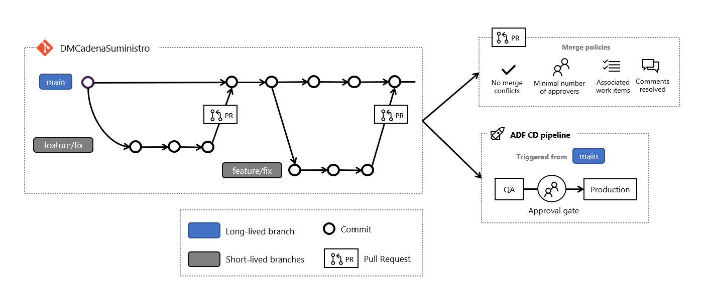
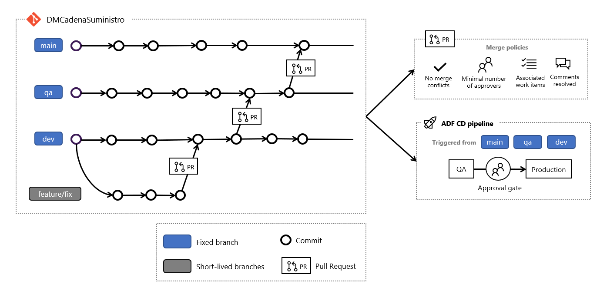

# [Flujo de trabajo de Git](https://dev.azure.com/ecopetrolad/BI/_backlogs/backlog/DM_CadenaSuministro/Epics/?workitem=122204)

## Resumen

Esta documentación contempla la definición del proceso de Git para el proyecto.

## Objetivos/alcance

* Definir el tipo de proceso de Git.
* Definir un conjunto de reglas para el flujo de trabajo con Git para los repositórios `DMDataPlatformTemplate` y `DMCadenaSuministro`.

## Fuera del alcance

* No contempla código para los repositórios.
* No contempla creación de políticas de branches.
* No contempla creación de pipelines.

## Diseño propuesto

[Scaled-Trunk Based Development](https://trunkbaseddevelopment.com/) es el proceso de Git que será utilizado para el flujo de trabajo en el proyecto, con las seguientes premisas:

* Se utiliza una rama fija (`main`) como el trunk.
* Se utilizan ramas de corta duración - conocidas también como *short-lived branches* - para el desarrollo de características y corrección de errores. Estas ramas idealmente deben tener duración de 1 o 2 dias maximo.

### Políticas de merge

* Asegurar que no haya conflictos de merge
* El código debe ser revisado y aprobado por al menos una persona
* Asegurar que al menos un work item esté asociado con el Pull Request
* Asegurar que todos los comentários en el Pull Request sean resueltos.

Ecopetrol utiliza el stándard de [GitFlow](https://www.atlassian.com/git/tutorials/comparing-workflows/gitflow-workflow) por default, donde las ramas de `desarrollo`, `QAS` y `producción` son ramas de larga vida (*long-lived branches*).

Pero el uso de ramas de larga vida para ambientes es considerado un *anti-pattern* por los seguientes puntos:

* Riesgo de hacer merges muy grandes en los ambientes y perder el control de lo que fue desplegado.
* El uso de GitFlow puede introducir un problema llamado **merge hell**, dónde merges pueden traer varios conflictos a ser resueltos. Este escenario generalmente ocurre cuando tienes un gran equipo de desarrollo trabajando en ramas a largo plazo.
* Los artefactos no son homogéneos en todos los entornos, especialmente entre QAS y produccion. Cuando hacemos merge entre ramas, cada rama tiene un conjunto de binarios generados, reduciendo la confianza de que los artefactos funcionan igualmente en los entornos.

Con el objetivo de reduzir estos riesgos y simplificar el proceso de desarrollo y despliegue de los recursos en los ambientes, fue definido que el proyecto de Cadena de Suministro será utilizado como un piloto para el patrón Scaled-Trunk.

## Tecnologías

* Git

## Referencias adicionales

* [Azure DevOps product group: How we deliver changes to production](https://docs.microsoft.com/en-us/azure/devops/learn/devops-at-microsoft/release-flow)
* [Common anti-patterns with branch based workflows](https://www.thoughtworks.com/insights/blog/enabling-trunk-based-development-deployment-pipelines)
* [Which Git branching model should I select for my project?](https://medium.com/aventude/which-git-branching-model-should-i-select-73aafc503b5f)
