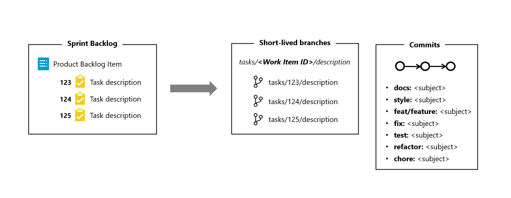

# [Convenciones de nombres para ramas y commits](https://dev.azure.com/ecopetrolad/BI/_backlogs/backlog/DM_CadenaSuministro/Epics/?workitem=122205)

## Resumen

* Esta documentación contempla la definición de un conjunto de reglas y convenciones para especificar los nombres, confirmaciones y branches de los repositorios GIT.

## Objetivos/alcance

* Especificar las convenciones para ramas.
* Especificar las convenciones para commits.

## Fuera del alcance

* No contempla código para los repositorios.

## Diseño propuesto

### Convenciones para ramas

 IDs de work items (como tasks y PBIs) son agregados como parte del nombre de las ramas de corta duración, como ramas de `feature` y `fix`. Esta estrategia trae las siguientes ventajas:

* Una forma simple de comunicar el equipo cuales son las tareas que están sendo desarrolladas.
* Una forma de asegurar que las ramas no se conviertan en ramas de larga duración, porque las tareas solo van a ser completadas cuando los merges son hechos el la rama `main`.

### Convenciones para mensajes de commit

Para convenciones de nomenclaturas en mensajes de commit, vamos a utilizar el patrón [Conventional Commits](https://www.conventionalcommits.org/es/v1.0.0-beta.3/). El uso de convenciones para commits trae las siguientes ventajas principales:

* Comunicar la naturaleza de los cambios a los demás integrantes del equipo, el público o cualquier otro interesado.
* Hacer más fácil a otras personas contribuir al proyecto, permitiendo explorar una historia de los commits más estructurada.
* Facilitar el proceso de troubleshooting, por hacer con que el proceso de identificación de un commit (o un conjunto de commits) que introdujo un error sea mas simple a través del uso de prefijos que traen el contexto de los commits.

Vamos a utilizar los seguientes prefijos:

* **docs:** Utilizado para crear o actualizar nuevos documentos.
* **style:** Utilizado para actualizar un estilo de un documento (una tabla en Markdown por ejemplo).
* **feat:** Utilizado para crear una nueva característica (*feature*) en el código.
* **fix:** Utilizado para arreglar código o documentos.
* **test:** Utilizado para crear nuevas pruebas (unitarias, integración, etc).
* **refactor:** Utilizado para refactorizar códigos.
* **chore:** Utilizado para cambiar algo que no és relacionado a código o documentación (cambiar el nombre de una carpeta, borrar archivos antigos, etc).

## Tecnología

* Git

## Referencias

* [Conventional Commits](https://www.conventionalcommits.org/en/v1.0.0/)
