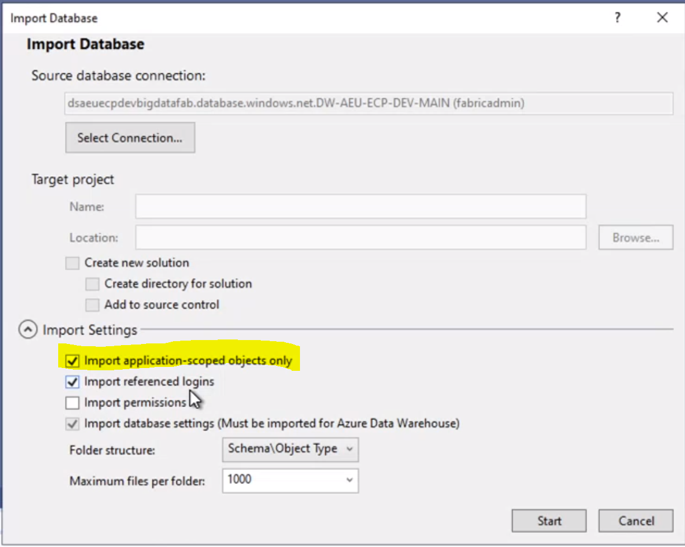
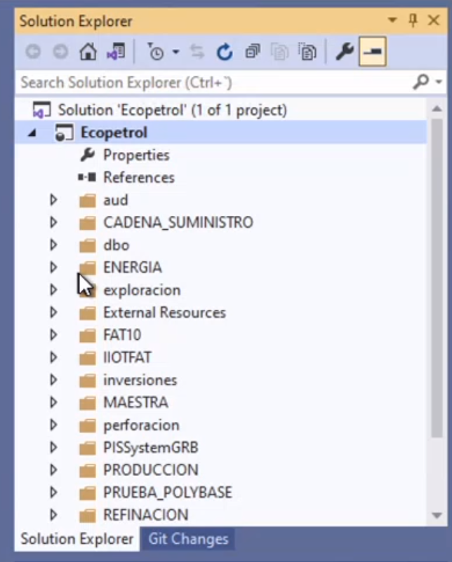
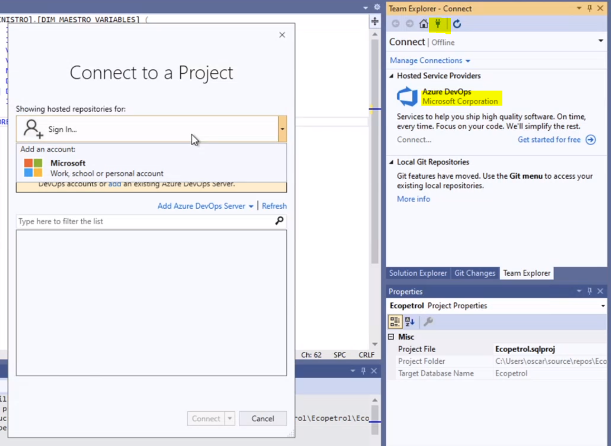

# [Estrategia de CI/CD para Azure Synapse](http://link-to-feature-or-story-work-item)

## Resumen

Actualmente, Ecopetrol cuenta con una instancia de Azure Synapse (DW-AEU.ECP-DEV-MAIN) Gen2: DW200.
Esta instancia cuenta con:

* 1 base de datos: dsaeuecpdevbigdaatafab.
* Múltiples tablas de dimensiones y hechos relacionados a un datamart (Cadena suministro, energía, inversiones, perforación, etc).
* Múltiples vistas relacionadas a un datamart.
* Múltiples procedimientos almacenados.

La nomenclatura de los objetos en la base de datos parece ser:

* Mayúsculas para el nombrado
* Palabras separadas por el delimitador guión bajo ('_')
* Las tablas de dimensión comienzan con DIM
* Las tablas de hechos comienzan con TH
* Las vistas comienzan con VM
* Los procedimientos almacenados comienzan con SP

Es importante mencionar que existen otros objetos que la nomenclatura no corresponde a la descrita anteriormente.

El desarrollo de los objetos para esta instancia de Azure Synapse ha sido conectarse a través de herramientas como Azure Data Studio al servidor, base de datos, y crear los objetos desde ahí. Estos objetos actualmente no se encuentran en ningún repositorio git, y está en el interés de Ecopetrol, poder almacenar estos objetos en un repositorio, y encontrar las mejores prácticas de desarrollo para Azure Synapse y sus ingenieros de datos.

## Objetivos/alcance

Dentro del objetivo, se encuentra describir la estrategia para que Ecopetrol pueda comenzar a implementar prácticas de CI/CD con Azure Synapse, especialmente en guardar los objetos en un repositorio git de Azure DevOps, y poder colaborar entre diferentes equipos y proyectos a una base de datos compartida en Synapse dentro de los ambientes de integración o desarrollo, calidad y productivo.

## Fuera del alcance

* Estrategias para otros productos o plataformas
* Evaluación de objetos y desarrollo en Synapse

## Diseño propuesto

### Generar un proyecto de Visual Studio por proyecto para la base de datos

Debido a que Ecopetrol cuenta con una sola instancia de base de datos para almacenar toda la información de diferentes proyectos o datamarts, y el ciclo de vida de cada uno de estos es diferente, es necesario que cada equipo de desarrollo pueda segmentar sus propios objetos.

La propuesta consiste en generar un repositorio por proyecto o datamart en el que se sincronice la instancia actual de Synapse.

Los pasos a seguir son los siguientes:

1. Generar un repositorio Git que sea Fork de DMDataPlatformTemplate, ya que ahí se cuenta con la estructura correcta para el desplieue automatizado.


2. Generar un proyecto de tipo de base de datos SQL en Visual Studio 2019.


3. Configurar el proyecto, y una vez creado, importar la base de datos de Synapse.


4. Configurar la conexión para que apunte a la base de datos de Synapse.


5. Seleccionar qué objetos de Synapse se van a importar.


6. Una vez terminada la confguración, se puede ver los objetos importados organizados en carpetas según el esquema correspondiente.


7. Ya que tenemos los objetos importados en el proyecto de Visual Studio. Es necesario conectar el proyecto al repositorio git de paso 1


8. Definir un perfil de publicación. Este paso es muy importante porque define cómo se va a publicar el SQL Pool. Para evitar que con cada proyecto se sobre escriban los objetos de bases de datos, es importante definir las siguientes características de la siguiente manera:

* CreateNewDatabase - Falso
* DropObjectsNotInSource - Falso
* TargetConnectionString - cadena de la base de datos de desarrollo o integración a la que se hará el despliegue.

Existen otras propiedades que se pueden configurar como exluír el despliegue de permisos, etc. Queda a consideración de Ecopetrol cómo decidan configurarlos.
```xml
<?xml version="1.0" encoding="utf-8"?>
<Project ToolsVersion="Current" xmlns="http://schemas.microsoft.com/developer/msbuild/2003">
  <PropertyGroup>
    <IncludeCompositeObjects>True</IncludeCompositeObjects>
    <DeployScriptFileName>deploy.sql</DeployScriptFileName>
    <ExcludeUsers>True</ExcludeUsers>
    <ExcludeLogins>True</ExcludeLogins>
    <ExcludeDatabaseRoles>True</ExcludeDatabaseRoles>
    <CreateNewDatabase>False</CreateNewDatabase>
    <BlockOnPossibleDataLoss>True</BlockOnPossibleDataLoss>
    <!-- If database is shared, this is a problem -->
    <DropObjectsNotInSource>False</DropObjectsNotInSource>
    <DoNotDropLogins>True</DoNotDropLogins>
    <DoNotDropUsers>True</DoNotDropUsers>
    <DoNotDropRoleMembership>True</DoNotDropRoleMembership>
    <DoNotDropApplicationRoles>True</DoNotDropApplicationRoles>
    <DoNotDropDatabaseRoles>True</DoNotDropDatabaseRoles>
    <DoNotDropPermissions>True</DoNotDropPermissions>
    <TargetConnectionString>Data Source=dsaeuecpdevbigdatafab.sql.azuresynapse.net;Persist Security Info=False;Pooling=False;MultipleActiveResultSets=False;Connect Timeout=60;Encrypt=False;TrustServerCertificate=False</TargetConnectionString>
    <TargetDatabaseName>Dedicated</TargetDatabaseName>
    <ProfileVersionNumber>1</ProfileVersionNumber>
  </PropertyGroup>
</Project>
```

Para que los ingenieros de datos puedan trabajar en el desarrollo de objetos en Synapse, necesitarán contar con Visual Studio 2019, y conectarse a este repositorio. Posteriormente, generar una rama para modificar o agregar los objetos necesarios, generar un pull request y esperar a que se acepten los cambios según con los criterios definidos de trabajo.

Para que el despliegue de los objetos pueda pasar de forma automatizada, se deberán generar pipelines de Azure DevOps que desplieguen los objetos en el repositorio git, en la instancia de Azure Synapse.

### Azure Synapse Workspace

Un Workspace de Synapse provee una consola integral de administración. Es importante mencionar, que sincronizar el Workspace de Synapse a un repositorio git nos ayuda a sincronizar los objetos relacionados a este espacio de trabajo, como integration runtimes, linked services, etc., mas no sincroniza los SQL Pools. Así que consideramos importante poder llevar las dos estrategias.

Para poder llevar esta estrategia es necesario crear un workspace en la instancia de Azure Synapse:


Una vez creado el workspace, es necesario configurar el repositorio git, y seleccionar que se desea importar los recursos existentes al repositorio.


Una vez configurado el repositorio, se puede ver la sincronización de los objetos. Dentro de la carpeta 'sqlscript' se encuentran las definiciones de tablas, vistas, etc.


Para que un ingeniero de datos pueda seguir con el desarrollo, puede conectarse a la instancia de Synapse a través de Synapse Studio. Crear una branch de trabajo y una vez que tenga sus cambios terminados, generar un pull request y esperar a que se acepten los cambios según con los criterios definidos de trabajo.


Una vez que los cambios se hayan aceptado, es necesario navegar a la branch de colaboración que se haya escogido, y publicar los cambios.


Para desplegar estos objetos en los diferentes ambientes, será necesario generar un pipeline en Azure DevOps que publique los objetos.

## Tecnologías

* Azure Synapse: Azure Synapse Analytics es un servicio de análisis ilimitado que reúne la integración de datos, el almacenamiento de datos empresariales y el análisis de macrodatos. Le da la libertad de consultar los datos como quiera, usando recursos sin servidor o dedicados, a gran escala.
* Visual Studio: Microsoft Visual Studio es un entorno de desarrollo integrado.
* Azure DevOps: Herramienta para la colaboración de equipos que trabajen con integración y despliegue continuo.

## Requisitos no funcionales

* Facilidad de trabajo e integración para los equipos de ingeniería de datos en Ecopetrol.

## Dependencias

* Instancia de Azure Synapse y objetos creados previamente.

## Conclusión

Para poder sincronizar los SQL Pools en Azure Synapse, y los objetos propios a un Workspace, es importante definir diferentes piplelines de trabajo que nos ayuden a llevar el ciclo de vida de los diferentes objetos en los diferentes proyectos.
Hacer uso de las bondades de Visual Studio y los pipelines de Azure DevOps para poder definir despliegues incrementales en las bases de datos hacen la diferencia para compartir una base de datos entre diferentes proyectos.

## Referencias adicionales

* [Habilitación de las características del área de trabajo de Synapse en un grupo existente de SQL dedicado](https://docs.microsoft.com/es-mx/azure/synapse-analytics/sql-data-warehouse/workspace-connected-experience)
* [Azure Synapse](https://docs.microsoft.com/en-us/azure/synapse-analytics/overview-what-is)
* [Azure Synapse CI/CD](https://techcommunity.microsoft.com/t5/data-architecture-blog/ci-cd-in-azure-synapse-analytics-part-1/ba-p/1964172)
