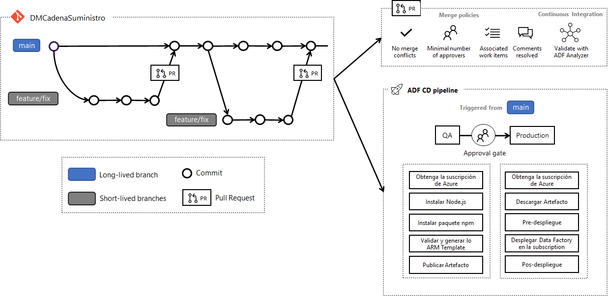

# [Estrategia de CI/CD para Azure Data Factory](https://dev.azure.com/ecopetrolad/BI/_backlogs/backlog/DM_CadenaSuministro/Backlog%20items/?workitem=126148)

## Resumen

Esta documentación contempla la definición de un pipeline CI/CD para Azure Data Factory.

## Objetivos/alcance

* Definir los jobs y pasos para validar, probar, construir e publicar Azure Data Factory.

## Fuera del alcance

* No contempla código para el pipeline.
* No contempla detalles de políticas de branches.

## Diseño propuesto




El CI pipeline se activa automáticamente cuando se crea un Pull Request (PR) y active la herramienta **ADF Analyzer**. 


El CD pipeline tiene dos jobs:

* Validar y Crear Data Factory ARM Template 

* Desplegar Data Factory en la subscripción


### **Validar y Crear Data Factory ARM Template**

1. **Obtenga la subscripción de Azure**: este paso obtiene el ID de subscripción de Azure y lo guarda en la variable SUBCRIPTION_ID.

1. **Instalar Node.js**: Instala Node.js 

1. **Instalar paquete npm**: Instala los paquetes npm guardados en su archivo ```package.json``` en la compilación. El paquete utilizado para crear lo ARM template es [@microsoft/azure-data-factory-utilities](https://www.npmjs.com/package/@microsoft/azure-data-factory-utilities), que es una biblioteca que proporciona una funcionalidad básica para validar y generar un template ARM dado un conjunto de recursos de Data Factory.

1. **Validar y generar lo ARM Template**: Valide y genera los ARM Template en la carpeta de destino, que es lo mismo que seleccionar "Publicar" en la UX. Los ARM Templates generado no se publican en la versión en vivo de la fábrica. El despliegue debe realizarse mediante el job _Desplegar Data Factory en la subscripción. 

1. **Publicar Artefacto**: Publica el artefacto que se utilizará como fuente para que lo despliegue Data Factory. 

### **Desplegar Data Factory en la subscripción**

1. **Obtenga la subscripción de Azure**: este paso obtiene el ID de subscripción de Azure y lo guarda en la variable SUBCRIPTION_ID.

1. **Descargar Artefacto**: Descargue el artefacto que se utilizará para despliegue. 

1. **Pre-despliegue**: Pausa los triggers antes del despliegue e incluye código para eliminar los recursos que se han eliminado. 

1. **Desplegar Data Factory en la subscription**: Desplegar Data Factory en la subscripción.

1. **Pos-despliegue**: Activa los triggers.


## Referencias

[Publicación automatizada para integración y entrega continuas](https://docs.microsoft.com/en-us/azure/data-factory/continuous-integration-deployment-improvements)

[Integración y entrega continuas en Azure Data Factory](https://docs.microsoft.com/en-us/azure/data-factory/continuous-integration-deployment)

[Utilidades de NPM Azure Data Factory](https://www.npmjs.com/package/@microsoft/azure-data-factory-utilities)