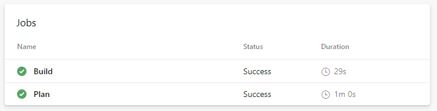
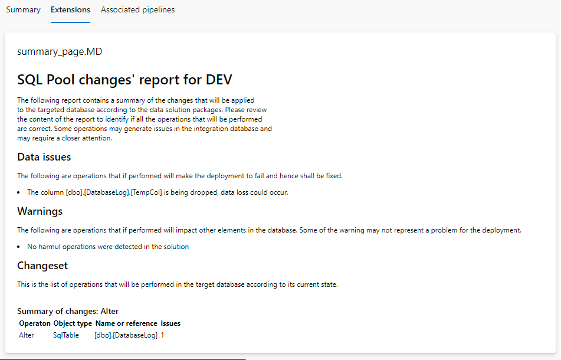
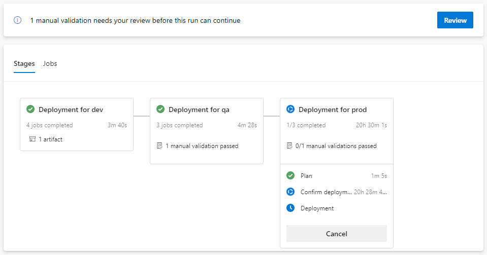
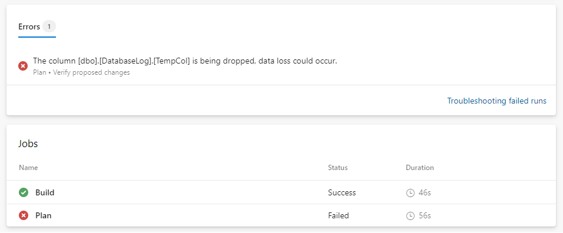
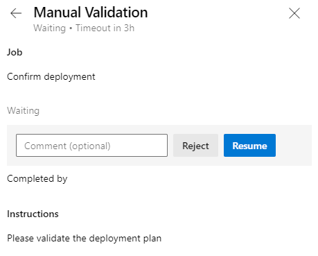

# Estrategia de CI/CD para Azure Synapse Pools

Esta revisión de diseño alcanza las prácticas que se utilizarán en los proyectos de ingeniería de datos que requieran el almacenamiento de datos estructurados en pools de servidores en Azure Synapse o instancias de Azure SQL Server junto con las configuraciones necesarias para habilitar integración y despliegue continuo.

## Azure Synpase Workspace

Para revisar como se integra este diseño con le proceso de CI/CD de Azure Synapse Workspace revise la [Revisión de diseño para el desarrollo en Azure Synapse](synapse-ci-cd-approach.md).

## Diseño de Data Marts y Data Warehouses

Cada base de datos será especificada a través de una solución de Visual Studio del tipo SQL Server Database Solution. Este tipo de soluciones nos darán la flexibilidad de desplegar nuestros esquemas de bases de datos de forma incremental e integrarlas con otras partes de la solución. Al momento de crear esta solución será importante especificar la instancia de Azure Synapse Pool que se utilizará para desarrollo/integración con el fin de que Visual Studio pueda ofrecer asistencia al desarrollo especifico para Azure Synapse.

Como se indica en la guía de desarrollo de Synapse, cada base de datos dispondrá de su propio esquema de base de datos para asegurar la correcta integración con otros dominios en aquellos casos donde se utilice infraestructura compartida.

### Control de versiones de código

Cada dominio dispone de su propio repositorio donde se indican todos los componentes que se utilizan, y esto incluye los esquemas de bases de datos o Data Marts que son necesarios para implementar la solución. Cada esquema de base de datos dispondrá de su propia solución de Visual Studio, contenido bajo el repositorio correspondiente del dominio, en el directorio `synapse\pools\[solutionName]`.

### Flujo de desarrollo

Se mantendrá el mismo flujo de trabajo y desarrollo que el resto del proyecto. Se utilizan ramas de corta duración - conocidas también como *short-lived branches* - para el desarrollo de características y corrección de errores. Estas ramas idealmente deben tener duración de 1 o 2 dias maximo.

## Integración continua

La solución base propone la utilización de un `Azure Pipeline` para la integración continua de código. El pipeline de integración continua (CI) se ejecutará cada vez que se haga un pull request a la branch 'main' dentro del folder `synapse/pools/*`, en este folder es en donde se almacenan los SQL Pools asignados a un proyecto en específico.

```yaml
trigger:
  branches:
    include:
    - main
  paths:
    include:
    - synapse/pools/*
```

Este pipeline dispone de 2 `stages`: Build y Plan.

- **Build:** Se encarga de la compilación de la solución de Visual Studio y la publicación del artefacto.
- **Plan:** Se encarga de verificar la factibilidad de ejecutar las operaciones de la solución que se compiló en la base de datos de Desarrollo (o integración). Para realizar esto, se utiliza la utilidad `SqlPackage` que al ejecutar la occión `DeployReport` contra el ambiente predefinido `dev`. 3 tipos de resultados se publican como resultado de la ejecución del pipeline:
- **Data issues:** Se corresponden a operaciones de base de datos que fallarán al momento de ejecutarse en el ambiente de desarrollo de integración. Estas operaciones son reportadas por el pipeline como `Errors` y por lo tanto hacen que el pipeline falle.
- **Warnings:** Se corresponden a operaciones de base de datos que podrían comprometer la integridad de los datos o que generarán una operación que no se podrá revertir. Estas operaciones son reportadas por el pipeline como `Warnings` y por lo tanto no impiden la ejecución satisfactoria.
- **Changelog:** Se corresponde con el detalle de todas las operaciones que se ejecutarán en la base de datos de desarrollo. Estas operaciones son aquellas que son requeridas para llevar a la base de datos de su esquema actual al esquema que propone la solución de Visual Studio.

La ejecución de estos procesos luce de la siguiente manera:



La etapada de planeamiento genera una página de validación con el resultado de todas las verificaciones que se realizan. Se puede encontrar dentro de la solapa `Extensions` en `Azure Pipelines`. Esta página provee una forma rápida de revisar los cambios que introduce una dada rama dentro de la base de datos.



## Despliegue continuo

La solución base propone la utilización de `Azure Pipeline` para el despliegue automatizado de las soluciones que involucran bases de datos de Azure Synapse. Este depliegue automatizado permite realizar las operaciones de forma repetible y asegurar que todos los cambios siempre se introducen a traves del control de versiones de código.

El pipeline de despliegue continuo automatiza el despliegue en los ambientes de DEV, QAS y PRD. En cada una de las etapas, el pipeline utiliza el perfil de despliegue de Azure Synpase y los parametros del pipeline que se corresponden con el ambiente en cuestión.



Cada uno de los ambientes ejecuta 3 o 4 jobs dependiendo del ambiente:
- **Build:** Este paso construye compila la solución de Visual Studio y la publica como un artefacto disponible para todas las siguientes etapas. La compilación de la solución solo se realiza una vez por lo cual no verá un proceso de `build` durante los despliegues de QAS ni PRD.
- **Plan:** Este paso descarga el artefacto que ha sido compilado y realiza una verificación de despliegue en el ambiente en cuestión utilizando la herramienta `SqlPackage`. La validación utiliza el perfil de despliegue de Azure Synapse especificos para cada ambiente y publica los resultados de la validación.
- **Confirm deployment:** Este paso espera por la validación de los aprobadores del despliegue. Tipicamente quienes aprueben los cambios deberán revisar el resultado de la validación para asegurarse de que los cambios que se introducen son los esperados.
- **Deployment:** Este paso despliega finalmente la solución en la instancia de Azure Synapse especificada.

### Planeamiento

Antes de comenzar el despliegue en un ambiente se ejecuta un proceso de planeamiento. El objetivo de este proceso es proveer información de los cambios que se planean hacer si se continua con el despliegue. Este proceso utiliza el archivo de perfil de despliegue de Azure Synapse para identificar como procesar los cambios. Cada etapa publica su propio reporte para cada uno de los ambientes correspondientes.

El reporte es analizado por el proceso de planeamiento y es capaz de emitir errores o advertencias dependiendo de la severidad de los hallazgos. De igual forma que el proceso de integración continua, esta etapa reportará:

- **Data issues:** Se corresponden a operaciones de base de datos que fallarán al momento de ejecutarse en el ambiente en cuestion y por lo tanto deben ser reparadas. Estas operaciones son reportadas por el pipeline como `Errors` y por lo tanto hacen que el pipeline falle.
- **Warnings:** Se corresponden a operaciones de base de datos que podrían comprometer la integridad de los datos o que generarán una operación que no se podrá revertir. Estas operaciones son reportadas por el pipeline como `Warnings` y por lo tanto no impiden la ejecución satisfactoria.



Puede acceder al detalle de todas las operaciones desde la solapa `Extensions`


### Aprobaciones

En el ambiente de dev, el despliegue no requiere aprobación y se comienza tan pronto como se inicia tan pronto como todas las validaciones son completadas. Los ambientes de QAS y PRD requieren de una aprobación la cual es configurada a través de los archivos de configuración de los pipelines.

Identificará cuando existe una validación pendiente en el estado de la ejecución del pipeline. El equipo del dominio deberá de configurar cuanto tiempo desea esperar por la validación antes de que el proceso se cancele.



Cuando se realiza la validación, quien revisa podrá adjuntar comentarios para documentar alguna observación que tiene sobre el despliegue. En general, quien aprueba estos cambios deberá revisar la página de validación que se genera en la etapa de planeamiento para segurarse de que todo luce como se espera.

Preste especial atención a que se genera un reporte por cada ambiente en el que se planea desplegar. Puede identificar a que ambiente pertence el reporte al revisar el título del mismo.

### Errores de despliegue

El despliegue se realiza a traves de la herramienta SqlPackage el cual encapsula toda la operación dentro de una transacción. Esto trae el benficio de que en caso de falla, la transacción ejecutará un Rollback para devolver a la base de datos al estado anterior. Sin embargo, existen algunas operaciones de bases de datos que Azure Synapse no permiten que se ejecuten dentro de una transacción. En este caso, el proceso de Planeamiento fallará.

## Configuración de ambientes

Tanto los procesos de integración continua como de despliegue continua utilizan configuraciones especiales que le permiten acceder a los determinados ambientes y que indican como se deben ejecutar las operaciones de depliegue y validación. Estas configuraciones son realizadas a traves de perfiles de despliegue de Azure Synapse y a traves de los parametros compartidos por los diferentes pipelines.

### Perfiles de despliegue de Azure Synapse

Cada ambiente dispondrá de un archivo de configuración de despliegue (en formato XML) ubicado en el directiroio `synapse\profiles\<nombre_del_ambiente>.profile.xml`. Estos archivos principalmente contienen la siguiente información:

- `<TargetConnectionString>`: Cadena de conexión a la instancia de Azure Synapse Pool donde se realizará el despliegue. Notar que la cadena de conexión no indica usuarios ni contraseñas.
- `<TargetDatabaseName>`: Nombre de la base de datos donde se desplegaran los cambios.
- *Otras configuraciones:* Existen otras propiedades que se pueden configurar como exluír el despliegue de permisos, etc. Queda a consideración de Ecopetrol cómo decidan configurarlos.

```xml
<Project ToolsVersion="Current" xmlns="http://schemas.microsoft.com/developer/msbuild/2003">
  <PropertyGroup>
    <IncludeCompositeObjects>True</IncludeCompositeObjects>
    <DeployScriptFileName>deploy.sql</DeployScriptFileName>
    <ExcludeUsers>True</ExcludeUsers>
    <ExcludeLogins>True</ExcludeLogins>
    <ExcludeDatabaseRoles>True</ExcludeDatabaseRoles>
    <CreateNewDatabase>False</CreateNewDatabase>
    <BlockOnPossibleDataLoss>False</BlockOnPossibleDataLoss>
    <DropObjectsNotInSource>False</DropObjectsNotInSource>
    <DoNotDropLogins>True</DoNotDropLogins>
    <DoNotDropUsers>True</DoNotDropUsers>
    <DoNotDropRoleMembership>True</DoNotDropRoleMembership>
    <DoNotDropApplicationRoles>True</DoNotDropApplicationRoles>
    <DoNotDropDatabaseRoles>True</DoNotDropDatabaseRoles>
    <DoNotDropPermissions>True</DoNotDropPermissions>
    <TargetConnectionString>Data Source=dsaeuecpdevbigdatafab.sql.azuresynapse.net;Persist Security Info=False;Pooling=False;MultipleActiveResultSets=False;Connect Timeout=60;Encrypt=False;TrustServerCertificate=False</TargetConnectionString>
    <TargetDatabaseName>Dedicated</TargetDatabaseName>
    <ProfileVersionNumber>1</ProfileVersionNumber>
  </PropertyGroup>
</Project>
```

### Variables de dominio y de ambientes

Todos los pipelines que contiene el repositorio utilizan parametros configurables que le permiten definir los diferentes ambientes y el dominio sobre el que está trabajando. Estas configuraciones, almacenadas en el directorio `azure-pipelines`, también aplican a los procesos de integración y despliegue de Azure Synapse Pools. Los parametros relevantes son:

- variable.domain.yml
  - `domainName`: Corresponde al nombre del dominio en cuestión. Este nombre debe coincidir con el nombre de la solución de Visual Studio que está generando.
- variable.environment.<nombre_del_ambiente>.yml
  - `azureServiceConnectionName`: Nombre de la conexión de servicios de Azure DevOps con Azure. Esta conexión será la que se utilizará para acceder la instancia de Azure Synapse. Vea la sección [Consideraciones de seguridad](#security-concerns)
  - `deploymentApprovers`: Lista de aprobadores que se necesitan para autorizar el despliegue en el ambiente en cuestión, si así lo requiriese.

### Consideraciones de seguridad

Para asegurar que los desarrolladores no puedan intervenir ninguno de los ambientes, desarrollo (integración), QAS o Producción, los mismos no disponen de permisos para realizar ninguna operación. Esto permite que la única forma de introducir cambios sea a través del control de versiones de código. La única excepción es al ambiente de desarrollo donde se les puede conceder permisos de lectura para conectar la solución de Visual Studio.

En este contexto, la forma en la que se realizan los despliegues a los diferentes ambientes es a traves del `Service Principal` que está configurado detrás de cada una de las conexiones a Azure de Azure DevOps. Tenga en cuenta que para que este usuario pueda acceder a los diferentes SQL Pools, se deberá adicionalmente conceder permisos al `Service Principal` sobre cada una de las bases de datos/SQL Pools. Para realizar esta configuración puede referirse al articulo [Create the service principal user in Azure SQL Database](https://docs.microsoft.com/en-us/azure/azure-sql/database/authentication-aad-service-principal-tutorial#create-the-service-principal-user-in-azure-sql-database)

### Consideraciones de recuperación

Queda fuera del alcance de las capacidades de CI/CD la implementación automática de una estrategia de copias de seguridad antes de ejecutar una operación de despliegue. Sin embargo, esta funcionalidad se recomienda implementar en releases futuros.
