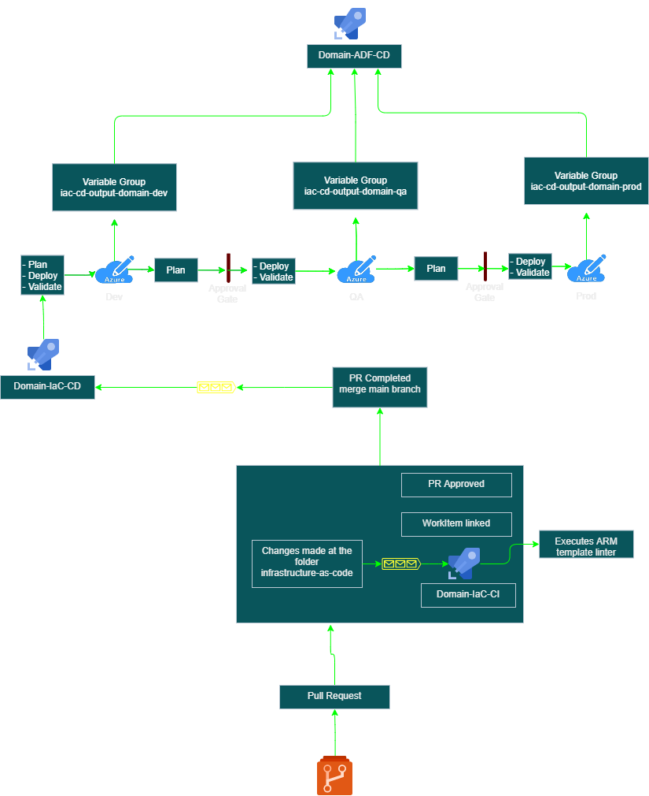
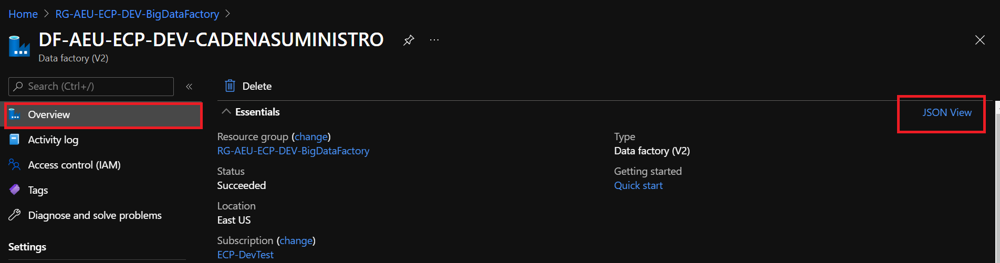
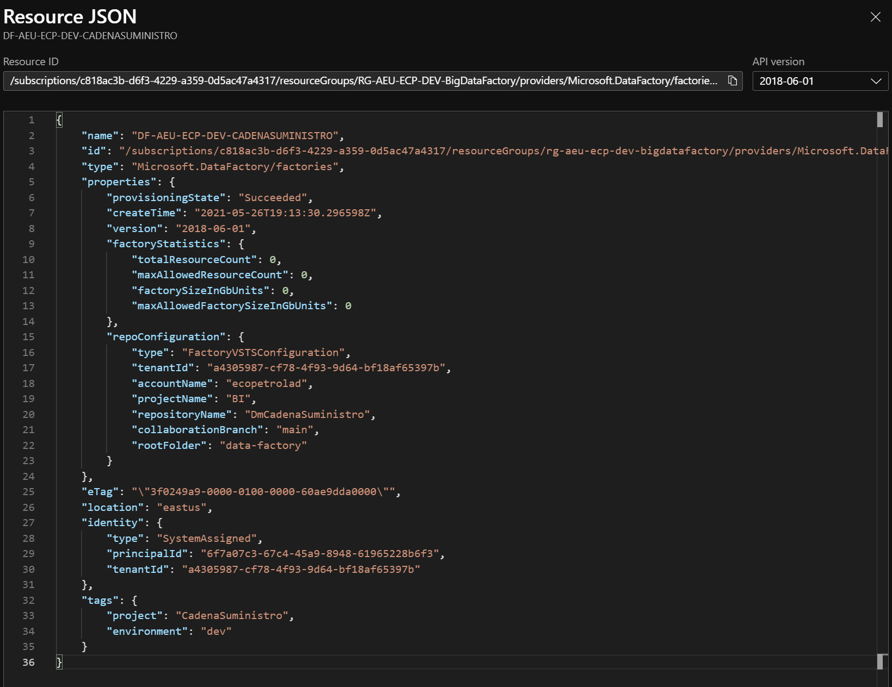

# Infrastructure as Code (IaC)



Table of content

[Overview](#overview)

[Organization](#organization)

[Making changes](#makingchanges)


## 1. <a id="overview">Overview</a>

The template uses ARM (Azure Resource Management) Template to deploy the domain infrastructure, ARM Templates allow the definition of repeatable infrastructure as JSON (JavaScript Object Notation). The template can be parameterized and this is a key factor that makes ARM Templates to be reused in different projects.

Check the official documentation:

- [Overview](https://docs.microsoft.com/en-us/azure/azure-resource-manager/templates/overview to know more about it)
- [First template tutorial](https://docs.microsoft.com/en-us/azure/azure-resource-manager/templates/template-tutorial-create-first-template?tabs=azure-powershell)

## 2. <a id="organization">Organization</a>

The ARM Template is located at `.\infrastructure-as-code`. The folder has the template `\azuredeploy.json` and a folder called `parameters` where are located the parameters JSON per environment

```
|- infrastructure-as-code
|--- parameters
|------ parameters.dev.json
|------ parameters.prd.json
|------ parameters.qas.json
|--- azuredeploy.json
```

**DO NOT HARD CODE VALUES INSIDE `AZUREDEPLOY.JSON`, AS IT MAKES IT HARD TO REUSE**

The template is divided into sections

- Parameters

    Define the parameters that are going to be used to customize the template, for instance `location`, `resource name prefix` in our case `DomainName` and so on

    Parameters can have a default value making than optional during the execution

- Functions

    Some code can be reused by defining a function, like ecopetrol.NamingConvention

- Variables

    Define variables that helps having a better reading of the code

- Resources

    Define the resources that is going to be deployed on Azure

- Outputs

    Defines the output values for the template like the uri of a key vault


Inside the Resources section we split them into separated `Microsoft.Resources/deployments` types:

- Domain Resources
- Role Assignments for shared Integration Runtime
- Add Key Vault access policy for the shared KV

The decision factor to use it the way it is today is the possibility of moving those deployments to a different template and also because it may target different Resource Groups.

On each deployment we are going to have sections mentioned above.

## 3. <a id="makingchanges">Making changes</a>

**Making changes to the template's ARM template will affect all the domain that are using the template**

Basically there are two types of changes that is going to be performed

- Updating existent resources
- Adding new resources

### Updating existent resources

Every resource that is defined at those three deployments mentioned above can be updated, one of the possible change is updating the SKU, for instance

To do that you will change the first deployment where the domain's resources are defined

Let's use as an example the Data Lake resource, for that move to the line `305` of `.\infrastructure-as-code\azuredeploy.json`.

``` json
            "type": "Microsoft.Storage/storageAccounts",
              "apiVersion": "2021-01-01",
              "name": "[parameters('storageName')]",
              "location": "[parameters('location')]",
              "sku": {
                "name": "Standard_LRS",
                "tier": "Standard"
              }
```

Let's say that there is a need to change the tier from `Standard` to `Premium`, just update the tier property to `Premium` and Azure will update the Storage Account created if the resource was already deployed or create a new one using the definition.

### Adding a new resource

Let's say that for a new domain there is a need to add Databricks, for instance

The very first thing to do is to find at the documentation what are the properties needed to create it, access the documentation [Define resources in ARM templates](https://docs.microsoft.com/en-us/azure/templates/) and under `Reference` look at the resource type that is needed, in our case [Databricks](https://docs.microsoft.com/en-us/azure/templates/microsoft.databricks/workspaces?tabs=json)

*Note: There is a combobox with the api versions available it is recommended the usage of latest*

Copy the template provided at the documentation using the `Copy` button, choose a proper place to add the new resource at the domain deployment and start making changes on the parameters you want to change, while changing it, some properties value will be promoted to parameters adding a subsequent change on the Parameters section of the main template and at the environment parameters file.

This first approach it is easy to follow when the resource is not complex, in some cases, it would be easier to use an existent resource already deployed, export its JSON and use it to make the changes that are needed.

You can export the JSON from an existent resource using the portal, as illustrated bellow.



When clicking on the `view Json`, the JSON will be presented



Copy the json, and using an code editor remove the properties that are exclusive for this resource (internal do Azure)

Original Json

``` json
{
    "name": "DF-AEU-ECP-DEV-CADENASUMINISTRO",
    "id": "/subscriptions/c818ac3b-d6f3-4229-a359-0d5ac47a4317/resourceGroups/rg-aeu-ecp-dev-bigdatafactory/providers/Microsoft.DataFactory/factories/df-aeu-ecp-dev-cadenasuministro",
    "type": "Microsoft.DataFactory/factories",
    "properties": {
        "provisioningState": "Succeeded",
        "createTime": "2021-05-26T19:13:30.296598Z",
        "version": "2018-06-01",
        "factoryStatistics": {
            "totalResourceCount": 0,
            "maxAllowedResourceCount": 0,
            "factorySizeInGbUnits": 0,
            "maxAllowedFactorySizeInGbUnits": 0
        },
        "repoConfiguration": {
            "type": "FactoryVSTSConfiguration",
            "tenantId": "a4305987-cf78-4f93-9d64-bf18af65397b",
            "accountName": "ecopetrolad",
            "projectName": "BI",
            "repositoryName": "DmCadenaSuministro",
            "collaborationBranch": "main",
            "rootFolder": "data-factory"
        }
    },
    "eTag": "\"3f0249a9-0000-0100-0000-60ae9dda0000\"",
    "location": "eastus",
    "identity": {
        "type": "SystemAssigned",
        "principalId": "6f7a07c3-67c4-45a9-8948-61965228b6f3",
        "tenantId": "a4305987-cf78-4f93-9d64-bf18af65397b"
    },
    "tags": {
        "project": "CadenaSuministro",
        "environment": "dev"
    }
}
```

After updating it

``` json
{
    "name": "DF-AEU-ECP-DEV-CADENASUMINISTRO",
    "type": "Microsoft.DataFactory/factories",
    "properties": {
        "repoConfiguration": {
            "type": "FactoryVSTSConfiguration",
            "tenantId": "a4305987-cf78-4f93-9d64-bf18af65397b",
            "accountName": "ecopetrolad",
            "projectName": "BI",
            "repositoryName": "DmCadenaSuministro",
            "collaborationBranch": "main",
            "rootFolder": "data-factory"
        }
    },
    "location": "eastus",
    "identity": {
        "type": "SystemAssigned"
    },
    "tags": {
        "project": "CadenaSuministro",
        "environment": "dev"
    }
}
```

Change the values that need to be changed to use `Parameters` and `Variables` to have the resource replicable.

``` Json
{
    "type": "Microsoft.DataFactory/factories",
    "apiVersion": "2018-06-01",
    "name": "[parameters('parameter')]",
    "properties": {
        "repoConfiguration": "[parameters('dataFactoryRepoConfiguration')]"
    },
    "location": "[parameters('parameter')]",
    "identity": {
        "type": "SystemAssigned"
    },
    "tags": "[parameters('resourcesTags')]"
}
```